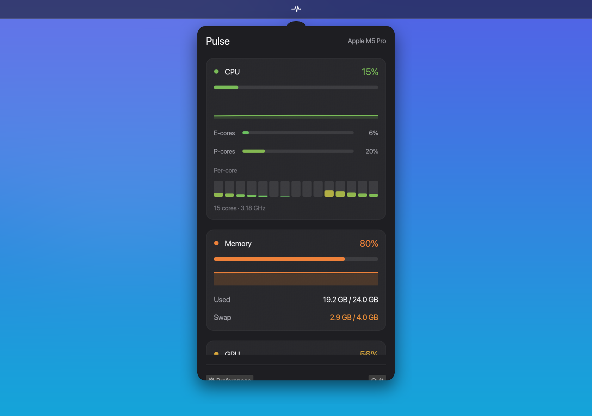

<h1 align="center">Pulse</h1>

<p align="center">A beautiful, lightweight macOS menu-bar monitor for live CPU, memory, GPU, disk, and network stats.</p>

<p align="center">
  
</p>

<p align="center">
  <a href="https://github.com/Alyetama/Pulse/releases/latest/download/Pulse.dmg"><b>⬇︎ Download for macOS</b></a>
  &nbsp;·&nbsp;
  <a href="https://Alyetama.github.io/Pulse">Website</a>
</p>

---

## Features

- **CPU** — overall %, E-core / P-core cluster residency, per-core bars, frequency
- **Memory** — used / total, %, and swap
- **GPU** — utilisation % + core count on Apple Silicon (via `macmon`, no `sudo`); degrades gracefully on Intel
- **Disk** — used % per mounted volume
- **Network** — live up/down throughput (rate from the delta between polls)
- **Power & thermals** — CPU / GPU / ANE watts, package power, CPU / GPU temperature
- **Top processes** — the 5 busiest by CPU, with memory
- Sparklines of recent history, green→amber→red threshold colouring, automatic light/dark mode
- Configurable menu-bar readout (CPU / GPU / Memory / icon-only) and poll interval, plus a Launch-at-Login toggle
- Runs as a menu-bar-only accessory (no Dock icon); sampling happens off the UI thread so it stays featherweight

Left-click the icon to open the panel, right-click for the menu (Preferences, Launch at Login, Quit).

## First launch (opening an unsigned app)

Pulse is signed **ad-hoc** (no paid Apple Developer ID), so macOS blocks it on first launch. Any one of these opens it — you only need to do this once:

1. **Right-click (Control-click)** `Pulse.app` in Finder → **Open** → **Open**.
2. If that's blocked on newer macOS: **System Settings → Privacy & Security → scroll down → "Open Anyway"**.
3. Terminal fallback:
   ```bash
   /usr/bin/xattr -dr com.apple.quarantine /Applications/Pulse.app
   ```

## Build from source

Requires a Rust toolchain, the Xcode command-line tools (`iconutil`, `sips`, `codesign`), and `rsvg-convert` (`brew install librsvg`).

```bash
git clone https://github.com/Alyetama/Pulse.git
cd Pulse
./scripts/make_icons.sh   # generate AppIcon.icns + the menu-bar template glyph
./scripts/bundle.sh       # release build → dist/Pulse.app, ad-hoc signed, installed to /Applications
./scripts/make_dmg.sh     # optional: build dist/Pulse.dmg
```

Built in Rust with [`tray-icon`](https://crates.io/crates/tray-icon) (menu-bar item), [`egui`](https://crates.io/crates/egui)/[`eframe`](https://crates.io/crates/eframe) (the popover), [`sysinfo`](https://crates.io/crates/sysinfo) (CPU/memory/disk/network) and [`macmon`](https://crates.io/crates/macmon) (GPU/power/temperature on Apple Silicon).

## License

[MIT](LICENSE) © 2026 Alyetama
